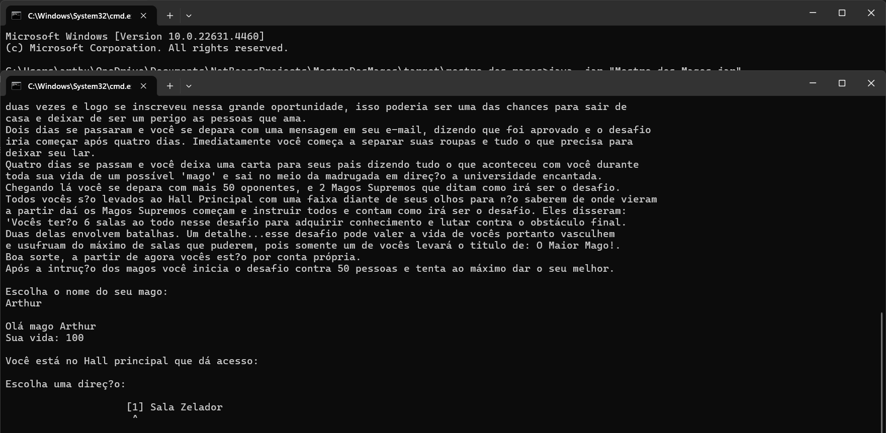
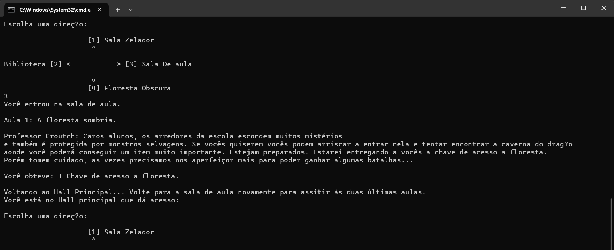
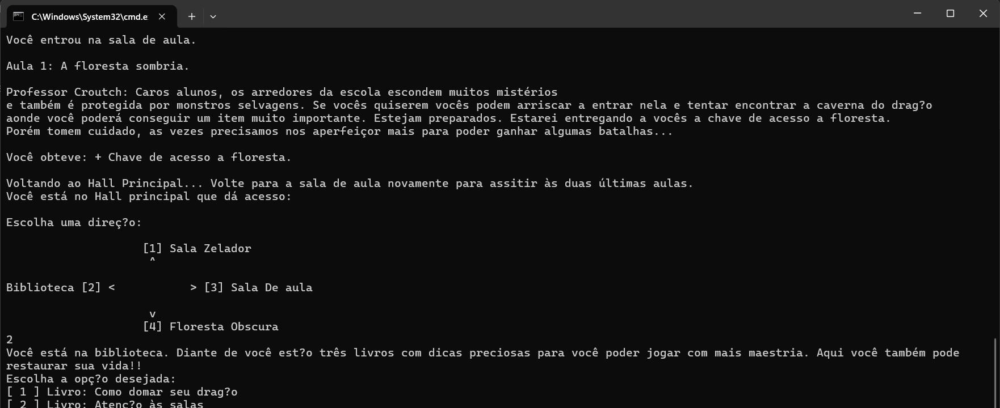
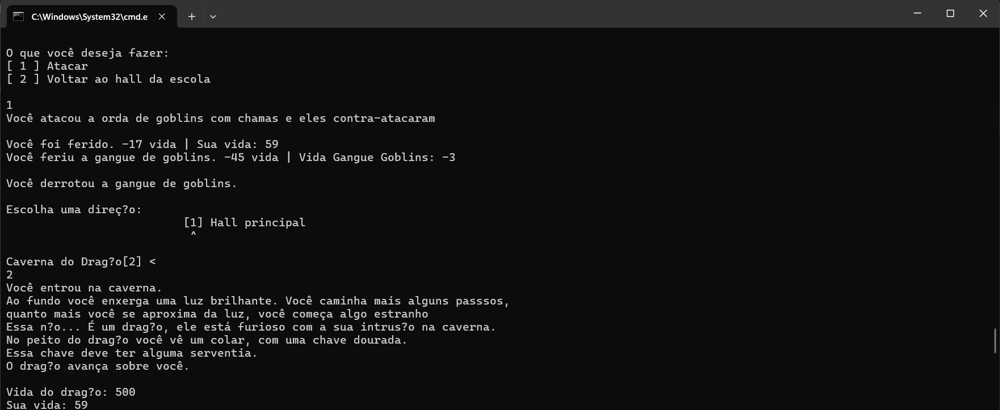
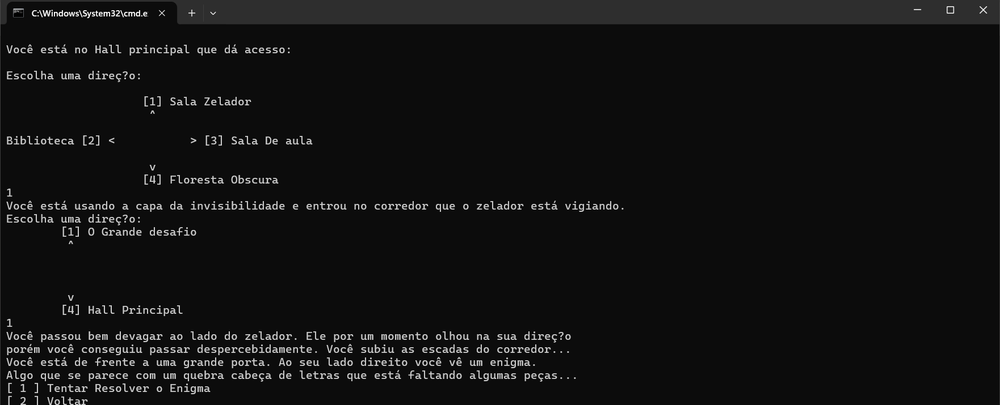
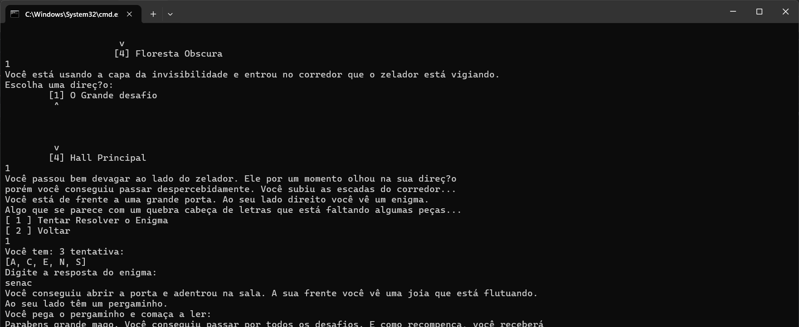

# 🧙‍♂️ Mestre dos Magos - RPG de Texto

Bem-vindo ao **Mestre dos Magos**, um jogo de RPG baseado em texto onde você assume o papel de um jovem mago em sua jornada de aprendizado e aventura! Explore, lute e resolva enigmas enquanto melhora suas habilidades mágicas.

## 🎮 Visão Geral do Jogo

**Mestre dos Magos** é um RPG baseado em texto onde os jogadores devem explorar diferentes áreas, aprender magias, combater inimigos e resolver enigmas para avançar na história.

### 🌟 Funcionalidades Principais
- **Sistema de Personagem**: Pontos de vida (máximo de 100 HP) e progressão de poder mágico.
- **Inventário**: Coleta e uso de itens especiais durante a aventura.
- **Sistema de Combate**: Combate em turnos com inimigos como goblins (60 HP) e o dragão (500 HP).
- **Enigmas**: Desafios e mecânicas de salas secretas que exigem lógica e estratégia.
- **Locais Principais**: Salão Principal, Sala de Aula, Biblioteca, Floresta Sombria, Caverna do Dragão.

## 🎯 Objetivos do Jogo

- Frequente aulas para aprender magia.
- Derrote o bando de goblins.
- Encontre itens poderosos como a **Chave Dourada** e a **Capa da Invisibilidade**.
- Resolva o enigma final e conquiste a **Joia Kzar**.

## 💻 Como Jogar

1. **Baixe o Jogo**: 
   - Baixe o arquivo JAR do jogo clicando no link abaixo:

     [Baixar o Jogo - Mestre dos Magos](#)

2. **Instruções para Executar o Jogo**:
   - Certifique-se de ter o [Java Runtime Environment (JRE)](https://www.java.com/pt-BR/download/) instalado no seu computador.
   - Após o download, localize o arquivo `MestreDosMagos.jar` na pasta onde foi salvo.
   - Abra o terminal ou prompt de comando na pasta onde o arquivo JAR foi baixado.
   - Execute o seguinte comando para iniciar o jogo:

     ```bash
     java -jar MestreDosMagos.jar
     ```

   - O jogo será iniciado e você poderá começar a aventura!

## 🧩 Mecânicas de Jogo

- **Sistema de Combate**: O jogo utiliza um sistema de combate baseado em turnos. O dano varia de acordo com a progressão do personagem.
- **Itens e Magias**: Durante sua jornada, você encontrará itens como a **Flauta Dourada**, a **Capa da Invisibilidade** e a **Joia Kzar**, que ajudam a avançar no jogo e derrotar inimigos poderosos.
- **Enigmas**: Ao explorar, você enfrentará enigmas desafiadores que exigem o uso estratégico de itens.

## 🎓 Contexto do Projeto

Este projeto foi desenvolvido como atividade do primeiro semestre do curso de **Análise e Desenvolvimento de Sistemas** no SENAC. Ele visa demonstrar conceitos fundamentais de programação, como:

- Programação orientada a objetos (POO)
- Estruturas de controle
- Manipulação de entrada de usuário
- Gerenciamento do estado do jogo

## 👥 Colaboradores

- **Arthur Silva Berdusco**
- **Cleriston Fernandes de Souza**
- **Jonathan Costa de Jesus**
- **Julio Cesar Ferreira**

## 💡 Dicas para Jogadores

- **Verifique sua saúde**: Sempre preste atenção à sua barra de vida antes de entrar em combates.
- **Leia os livros**: A Biblioteca contém dicas importantes para a progressão no jogo.
- **Frequente todas as aulas**: Elas desbloqueiam habilidades e áreas novas.
- **Use itens estrategicamente**: A **Flauta Dourada** pode ser essencial na luta contra o dragão.
- **Guarde a Capa da Invisibilidade**: Você precisará dela na área final.

## 🖼️ Imagens do Jogo








---

Este projeto reflete o aprendizado de programação em Java e a colaboração entre os desenvolvedores. Prepare-se para embarcar em uma aventura mágica e testar suas habilidades!
